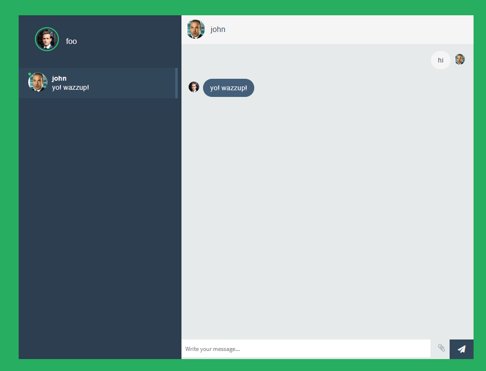

# About

Chatty ui - a simple chat application. My first attempt of coding with React + Redux.

# Backend

This repository only contains the UI for the chat. The backend is stored under:
https://github.com/kamiljano/chatty-server

# Configuration

The environment-specific parameters (like the backend url) are placed in .env

# Development

If this is the first time you're trying to run this application, install the dependencies with
`npm install`.

Then you can start the development server by executing `npm start`